<div align="center">
  
  <h1>Upload-Assistant</h1>
  <p>Streamline media preparation and uploads across private trackers & usenet indexers.</p>

[](https://www.python.org/) [](LICENSE) [](https://github.com/astral-sh/ruff) [](https://github.com/microsoft/pyright) [](https://prettier.io) [](https://github.com/wastaken7/Upload-Assistant/actions/workflows/docker-image.yml)

</div>

> [!IMPORTANT]
> **This is a modified version of the Upload Assistant project and is not affiliated with or endorsed by Audionut.**

## Table of Contents

- [Fork Features & Differences from Upstream (Audionut/Upload-Assistant)](#fork-features--differences-from-upstream-audionutupload-assistant)
  - [1. New Media Category Support](#1-new-media-category-support)
  - [2. Audio Stream Spectrogram Generation](#2-audio-stream-spectrogram-generation)
  - [3. qBittorrent Bandwidth Control](#3-qbittorrent-bandwidth-control)
  - [4. Argument-Embedded Text Queue](#4-argument-embedded-text-queue)
  - [5. Usenet & Indexer Posting](#5-usenet--indexer-posting)
  - [6. Interactive Screenshot Review Workflow](#6-interactive-screenshot-review-workflow)
  - [7. Persistent TTL-Based Metadata Cache](#7-persistent-ttl-based-metadata-cache)
  - [8. Modern Web UI & Real-Time Engine](#8-modern-web-ui--real-time-engine)
- [Supported Sites](#supported-sites)
- [Setup Guide](#setup-guide)
  - [Step 1: Install Required Tools](#step-1-install-required-tools)
  - [Step 2: Download Upload Assistant](#step-2-download-upload-assistant-linuxmacos)
  - [Step 3: Install Python Packages](#step-3-install-python-packages-linuxmacos)
  - [Step 4: Configure the Assistant](#step-4-configure-the-assistant)
- [Updating](#updating)
- [CLI Usage](#cli-usage)
- [Docker Usage](#docker-usage)
- [Seedbox / Linux Install](docs/seedbox.md)
- [Attributions](#attributions)

## Fork Features & Differences from Upstream (Audionut/Upload-Assistant)

This branch introduces new media categories and automation features not present in the upstream Audionut repository:

### 1. New Media Category Support

- **Ebook & Audiobook (`BOOK` Category)**:
  - **Automatic Type Detection**: Classifies uploads into Ebooks (PDF, EPUB, MOBI), Comics/Manga (CBR, CBZ), Newspapers, or Audiobooks.
  - **Local Metadata Extraction**: Reads metadata from OPF files in EPUB/MOBI, `ComicInfo.xml` in CBR/CBZ, parses tags via Mutagen for audiobooks, and uses PyMuPDF (`fitz`) with checksum-validated regex to extract ISBNs from PDFs.
  - **API Integrations**: Queries **MyAnonamouse (MAM) API**, **Google Books API**, and **OpenLibrary API** for automated metadata lookup.
  - **Artwork & Screenshot Generation**: Renders gallery screenshots from PDF/EPUB pages, extracts cover artwork, and auto-generates `POSTER.png`.
  - **Smart Duplicate Checking**: Custom rules distinguishing formats (e.g., EPUB vs PDF) and audiobooks vs ebooks, with tracker-specific overrides.
- **Video Game (`GAME` Category)**:
  - **Game Directory Parsing**: Priority scans for executables (`.exe`), disc images (`.iso`), or archives (`.rar`, `.zip`, etc.) in the upload path.
  - **IGDB & Steam Metadata API**: Queries Twitch/IGDB API for storyline, ratings, involved companies, release year, genre mapping, and downloads cover images. Fetches PC system requirements via Steam Store API.
  - **Platform Detection**: Identifies systems (PC, PS5, Switch, Xbox Series X|S, etc.) and enforces platform-group duplicate checks (so Switch uploads aren't blocked by PC dupes).
  - **Platform-specific Prompts**: Attended prompts for console TV standard (NTSC/PAL) and region codes (USA/EUR/JPN) for trackers like BJSHARE.
- **Music (`MUSIC` Category)**:
  - **Local Tag & Metadata Extraction**: Parses audio tags, cue sheets, and rip logs (EAC, XLD, etc.) using Mutagen to extract tracklists, artists, and audio metadata.
  - **Discogs & MusicBrainz APIs**: Optionally queries external APIs (Discogs via release/master ID or URL, and MusicBrainz) for metadata enrichment.
  - **Artwork & Cover Extraction**: Automatically searches for local cover images or extracts embedded artwork from FLAC/MP3/M4A tags to upload to image hosts.
  - **Preflight & Rule Validation**: Enforces mechanical validation for audio formats, sample/bit rates, track counts, and hybrid setups before uploading.

### 2. Audio Stream Spectrogram Generation

- **Spectrogram Extraction & Plotting**: Use `-as` / `--audio-spectrogram` to automatically extract audio streams from MKVs, Blu-ray BDInfo, music tracks, or audiobook chapters using FFmpeg and plot frequency/time graphs (inferno theme) via `librosa` and `matplotlib`. Music and audiobook processing is capped by `audio_spectrogram_max_files`.
- **Automated Upload**: Automatically uploads generated spectrograms along with your screenshots for release verification.
- **Stream Selection**: Supports targeting specific tracks using `-ast` / `--audio-spectrogram-tracks` (e.g., track indexes or `all`).

### 3. qBittorrent Bandwidth Control

- **Traffic Control**: Prevents overloading your connection during uploads using `-qbcon` / `--qbit-bw-control`.
- **Dynamic Wait**: Pauses uploading if your active client upload speed exceeds a threshold (`qbit_bandwidth_threshold` KB/s) and resumes once it stays below the limit for a set time (`qbit_bandwidth_time` seconds).
- **Safe Rechecking**: Performs a second duplicate check after the bandwidth wait to ensure a duplicate wasn't posted while the client was waiting.

### 4. Argument-Embedded Text Queue

- **Custom Parameter Queues**: When running batch uploads with a `.txt` queue file, each line is treated as an independent execution command.
- **shlex-Split Parsing**: Allows specifying unique CLI arguments (e.g., different IMDB IDs, tags, or tracker targets) for each file/folder on its respective line.
- **Resume Capability**: Logs processed lines to prevent reprocessing completed uploads if a queue run is interrupted.

### 5. Usenet & Indexer Posting

- **Usenet Upload Support**: Automatically archives and splits files/folders (via `7z`), generates parity recovery blocks (via `par2`), and uploads them to Usenet (via `nyuu`).
- **Anonymity & Privacy**: Generates randomized poster details and obfuscates post subject lines to protect privacy.
- **Indexer Integration**: Automatically uploads the generated `.nzb` file to configured Usenet indexers.

### 6. Interactive Screenshot Review Workflow

- **Manual Screenshot Review**: Inspect, add, delete, or replace/recapture individual frames before uploading through the interactive Web UI.

### 7. Persistent TTL-Based Metadata Cache

- **Provider-Scoped API Caching**: Disk-cached metadata for TMDb, IMDb, TVDB, TVmaze, OpenLibrary, IGDB, Discogs, and MusicBrainz.
- **Performance & Rate Limit Protection**: Configurable TTL and negative caching reuse fetched metadata across runs, avoiding redundant API calls and preventing rate-limiting bans.

### 8. Modern Web UI & Real-Time Engine

- **Full Parity Web UI**: Modern interface providing full feature parity with CLI options (`--webui`).
- **Real-Time Execution & Presets**: Live log streams, real-time preparation preview, preset saving, and interactive screenshot management.

## Supported Sites

<details>
<summary><strong>Click to view Supported Torrent Trackers</strong></summary>

|                                                                                            | Site                   | Usage                  | Supported Categories         |
| ------------------------------------------------------------------------------------------ | ---------------------- | ---------------------- | ---------------------------- |
|                  | Aither                 | AITHER                 | MOVIE, TV                    |
|              | Alpharatio             | ALPHARATIO             | MOVIE, TV                    |
|             | Amigos-Share           | AMIGOSSHARE            | MOVIE, TV, BOOK, GAME        |
|               | Anthelion              | ANTHELION              | MOVIE                        |
|             | AsianCinema            | ASIANCINEMA            | MOVIE, TV                    |
|                  | Aura4K                 | AURA4K                 | MOVIE, TV                    |
|                 | AvistaZ                | AVISTAZ                | MOVIE, TV                    |
|                | Beyond-HD              | BEYONDHD               | MOVIE, TV                    |
|                 | BitHDTV                | BITHDTV                | MOVIE, TV                    |
|                | Blutopia               | BLUTOPIA               | MOVIE, TV                    |
|                 | BrasilJapão-Share      | BJSHARE                | MOVIE, TV, BOOK, GAME        |
|           | BrasilTracker          | BRASILTRACKER          | MOVIE, TV, BOOK, GAME        |
|              | CapybaraBR             | CAPYBARABR             | MOVIE, TV, BOOK, GAME        |
|          | Cathode-Ray.Tube       | CATHODERAYTUBE         | MOVIE, TV, GAME              |
|               | Cinematik              | CINEMATIK              | MOVIE, TV                    |
|                 | CinemaZ                | CINEMAZ                | MOVIE, TV                    |
|               | DarkPeers              | DARKPEERS              | MOVIE, TV, BOOK, GAME, MUSIC |
|            | DesiTorrents           | DESITORRENTS           | MOVIE, TV                    |
|             | DigitalCore            | DIGITALCORE            | MOVIE, TV, BOOK, GAME, MUSIC |
|                | Emuwarez               | EMUWAREZ               | MOVIE, TV                    |
|                | FileList               | FILELIST               | MOVIE, TV                    |
|                 | FunFile                | FUNFILE                | MOVIE, TV                    |
|         | GreatPosterWall        | GREATPOSTERWALL        | MOVIE                        |
|                | hawke-uno              | HAWKEUNO               | MOVIE, TV                    |
|                  | HDBits                 | HDBITS                 | MOVIE, TV                    |
|                 | HD-Space               | HDSPACE                | MOVIE, TV                    |
|              | HD-Torrents            | HDTORRENTS             | MOVIE, TV                    |
|           | HomieHelpDesk          | HOMIEHELPDESK          | MOVIE, TV, BOOK, GAME, MUSIC |
|            | ImmortalSeed           | IMMORTALSEED           | MOVIE, TV, BOOK, MUSIC, GAME |
|              | InfinityHD             | INFINITYHD             | MOVIE, TV                    |
|              | IPTorrents             | IPTORRENTS             | MOVIE, TV, BOOK, GAME, MUSIC |
|             | ItaTorrents            | ITATORRENTS            | MOVIE, TV                    |
|                 | lajidui                | LAJIDUI                | MOVIE, TV                    |
|  | LastDigitalUnderground | LASTDIGITALUNDERGROUND | MOVIE, TV, BOOK              |
|                 | Lat-Team               | LATTEAM                | MOVIE, TV, BOOK              |
|                | Locadora               | LOCADORA               | MOVIE, TV                    |
|                  | LongPT                 | LONGPT                 | MOVIE, TV                    |
|                     | LST                    | LST                    | MOVIE, TV, BOOK, MUSIC       |
|                | Luminarr               | LUMINARR               | MOVIE, TV                    |
|               | MakingOff              | MAKINGOFF              | MOVIE                        |
|           | MidnightScene          | MIDNIGHTSCENE          | MOVIE, TV, GAME, MUSIC       |
|              | MoreThanTV             | MORETHANTV             | MOVIE, TV                    |
|                   | M-Team                 | MTEAM                  | MOVIE, TV                    |
|               | Nebulance              | NEBULANCE              | TV                           |
|           | NordicQuality          | NORDICQUALITY          | MOVIE, TV, MUSIC, BOOK, GAME |
|           | OldToonsWorld          | OLDTOONSWORLD          | MOVIE, TV                    |
|             | OnlyEncodes+           | ONLYENCODES            | MOVIE, TV                    |
|                 | Orpheus                | ORPHEUS                | MUSIC                        |
|          | PassThePopcorn         | PASSTHEPOPCORN         | MOVIE                        |
|              | PeerGarden             | PEERGARDEN             | MOVIE, TV, GAME, BOOK, MUSIC |
|           | PolishTorrent          | POLISHTORRENT          | MOVIE, TV                    |
|                | Portugas               | PORTUGAS               | MOVIE, TV                    |
|               | PrivateHD              | PRIVATEHD              | MOVIE, TV                    |
|                   | PT GTK                 | PTGTK                  | MOVIE, TV                    |
|                  | ptcafe                 | PTCAFE                 | MOVIE, TV                    |
|                | PTerClub               | PTERCLUB               | MOVIE, TV                    |
|                  | PTFans                 | PTFANS                 | MOVIE, TV                    |
|                  | PTSKIT                 | PTSKIT                 | MOVIE, TV                    |
|         | Racing4Everyone        | RACING4EVERYONE        | MOVIE, TV                    |
|               | RailgunPT              | RAILGUNPT              | MOVIE, TV                    |
|             | Rastastugan            | RASTASTUGAN            | MOVIE, TV, BOOK, GAME, MUSIC |
|                | ReelFLiX               | REELFLIX               | MOVIE                        |
|               | RetroFlix              | RETROFLIX              | MOVIE, TV                    |
|         | RetroMoviesClub        | RETROMOVIESCLUB        | MOVIE                        |
|              | Samaritano             | SAMARITANO             | MOVIE, TV, BOOK, GAME        |
|                | seedpool               | SEEDPOOL               | MOVIE, TV, BOOK, GAME, MUSIC |
|             | ShareIsland            | SHAREISLAND            | MOVIE, TV                    |
|      | SkipTheCommerials      | SKIPTHECOMMERCIALS     | MOVIE, TV                    |
|                | SpeedApp               | SPEEDAPP               | MOVIE, TV, BOOK, GAME, MUSIC |
|               | Swarmazon              | SWARMAZON              | MOVIE, TV                    |
|            | The Leach Zone         | THELEACHZONE           | MOVIE, TV                    |
|            | TheOldSchool           | THEOLDSCHOOL           | MOVIE, TV                    |
|             | Torrenteros            | TORRENTEROS            | MOVIE, TV                    |
|               | TorrentHR              | TORRENTHR              | MOVIE, TV                    |
|            | TorrentLeech           | TORRENTLEECH           | MOVIE, TV, BOOK, GAME, MUSIC |
|              | ToTheGlory             | TOTHEGLORY             | MOVIE, TV                    |
|               | TVChaosUK              | TVCHAOSUK              | MOVIE, TV                    |
|                    | ULCX                   | ULCX                   | MOVIE, TV                    |
|                                                                                            | Unwalled               | UNWALLED               | PODCAST                      |
|                  | UTOPIA                 | UTOPIA                 | MOVIE, TV                    |
|                 | YUSCENE                | YUSCENE                | MOVIE, TV, BOOK, GAME, MUSIC |
|                  | Zenith                 | ZENITH                 | MOVIE, TV, BOOK, GAME, MUSIC |

</details>

<details>
<summary><strong>Click to view Supported Usenet Indexers</strong></summary>

|                                                                                 | Site        | Usage       | Supported Categories  |
| ------------------------------------------------------------------------------- | ----------- | ----------- | --------------------- |
|     | Curupira    | CURUPIRA    | MOVIE, TV, BOOK, GAME |
|  | DrunkenSlug | DRUNKENSLUG | MOVIE, TV, BOOK, GAME |

</details>

## **Setup Guide**

Setting up Upload Assistant is straightforward, even if you are not a developer. Follow these steps to get up and running:

### Step 1: Install Required Tools

Windows users should install Upload Assistant with the [Windows `.exe` installer](docs/windows-install.md). It includes everything needed to run the assistant.

For a manual Linux/macOS/Windows installation, Upload Assistant needs a few tools to process media and run:

1. **Python (version 3.14 or newer)**:
   - Download and install it from the [official Python website](https://www.python.org/downloads/).
2. **MediaInfo & FFmpeg**:
   - These are helper tools used to scan files and generate screenshots/spectrograms.
   - Install them using your system's software manager:
     - Debian/Ubuntu: `sudo apt install mediainfo ffmpeg`
     - Arch Linux: `sudo pacman -S mediainfo ffmpeg`
     - RedHat/Fedora: `sudo dnf install mediainfo ffmpeg`
   - _Having issues with FFmpeg? Check out our [FFmpeg troubleshooting guide](docs/ffmpeg-max-workers-issues.md)._

---

### Step 2: Download Upload Assistant (Linux/macOS)

Choose **one** of the two options below to get the files onto your computer:

#### Option A: Clone using Git (Recommended)

Using Git is the recommended method because it makes updating the assistant in the future extremely easy.

1. **Install Git** (if you don't already have it):
   - **Linux:** Install it via your package manager.
   - **macOS:** Install it via Homebrew or Xcode Command Line Tools.
2. **Clone the project**:
   Open your command prompt or terminal, navigate to the folder where you want to keep the assistant, and run:

   ```bash
   git clone https://github.com/wastaken7/Upload-Assistant.git
   cd Upload-Assistant
   ```

#### Option B: Download as a ZIP file (Alternative)

If you do not want to install Git, you can download a copy of the files directly:

1. Go to the [GitHub Repository Page](https://github.com/wastaken7/Upload-Assistant).
2. Click the green **Code** button near the top right, and click **Download ZIP**.
3. Extract the ZIP file to a folder of your choice on your computer.

---

### Step 3: Install Python Packages (Linux/macOS)

On Linux/macOS, open a terminal, navigate to the folder where you downloaded Upload Assistant, and run:

```bash
pip3 install --user -U -r requirements.txt
```

> [!TIP]
> **Getting an "externally managed environment" error?**
> This means your system prefers keeping Python packages separated. You can set up a "Virtual Environment" (a private workspace for this tool) by running:
>
> - **Linux / macOS:**
>
>   ```bash
>   python3 -m venv venv
>   source venv/bin/activate
>   pip install -r requirements.txt
>   ```

---

### Step 4: Configure the Assistant

You need to add your API keys (like TMDb) and tracker credentials so the tool knows where to upload.

#### Method A: Use the Web UI (Easiest)

If you plan to use the Web UI, **your configuration file will be generated automatically** when you launch and configure it for the first time.

#### Method B: Use the Interactive Generator

In your terminal, run the command for your operating system and follow the on-screen prompts:

- **Windows:** Install with the [`.exe` installer](docs/windows-install.md), then run `ua-config` in a new terminal.
- **Linux / macOS:**

  ```bash
  python3 config-generator.py
  ```

#### Method C: Manual Configuration

1. Go to the `data/` folder inside the project.
2. Copy `example_config.py` and rename the copy to `config.py` (leave the original `example_config.py` file as-is).
3. Open `config.py` in a text editor (like Notepad, VS Code, or TextEdit) and fill in your information.
   - For detailed info on what each setting does, see [Example Config Docs](docs/example-config.md).
   - Get a free TMDb API key from [TheMovieDB API settings](https://www.themoviedb.org/settings/api).

---

**Additional Resources:**

- Check out our [Wiki Help Page](docs/home.md).
- Windows installation and basic commands: see [Windows Install](docs/windows-install.md).
- Need a no-root Linux or seedbox setup? See [Seedbox / Linux Install](docs/seedbox.md).
- Found an issue or need help? Please [open a GitHub Issue](https://github.com/wastaken7/Upload-Assistant/issues) so we can track and resolve it.

## **Updating:**

- To update a Git installation, navigate into the Upload-Assistant directory and pull the latest changes:

  ```bash
  cd Upload-Assistant
  git pull
  ```

- Or, if you downloaded the ZIP file, download a fresh ZIP from GitHub and overwrite your existing files.
- For the Windows installation, run `ua-update`.
- Run the command to update dependencies:
  - **Linux / macOS:** `python3 -m pip install --user -U -r requirements.txt`
- Run the configuration generator to fetch any new settings:
  - **Windows:** run `ua-config` from any folder.
  - **Linux / macOS:** `python3 config-generator.py`

## **CLI Usage:**

To run the assistant, use the command for your system:

- **Windows:**

  ```cmd
  ua "C:\path\to\content" --args
  ```

- **Linux / macOS:**

  ```bash
  python3 upload.py "/path/to/content" --args
  ```

Arguments are optional and normally follow the path. Input modes such as `--paths-from-stdin` may omit the positional path. For a list of all available arguments, pass `--help`.
The file/folder path works best enclosed in double quotes.

- CLI arguments: [docs/cli-args.md](docs/cli-args.md)
- Usenet uploading: [docs/usenet.md](docs/usenet.md)

## **Docker Usage:**

Visit our wonderful [docker usage](docs/docker.md)

Also see this excellent video put together by a community member <https://videos.badkitty.zone/ua>

Web UI setup (Docker GUI / Unraid): [docs/docker-gui.md](docs/docker-gui.md)
Web UI docs: [docs/web-ui.md](docs/web-ui.md)

## **Attributions:**

Built with [autobrr/go-bdinfo](https://github.com/autobrr/go-bdinfo)

Features automated binary managers for:

- [nyuu](https://github.com/animetosho/nyuu)
- [par2cmdline-turbo](https://github.com/animetosho/par2cmdline-turbo)
- [pesto](https://github.com/franzopl/pesto)
- [7-Zip](https://www.7-zip.org/)

<p>
  <a href="https://github.com/autobrr/mkbrr"></a>&nbsp;&nbsp;
  <a href="https://github.com/autobrr/qui"></a>&nbsp;&nbsp;
  <a href="https://ffmpeg.org/"></a>&nbsp;&nbsp;
  <a href="https://mediaarea.net/en/MediaInfo"></a>&nbsp;&nbsp;
  <a href="https://www.themoviedb.org/"></a>&nbsp;&nbsp;
  <a href="https://www.imdb.com/"></a>&nbsp;&nbsp;
  <a href="https://thetvdb.com/"></a>&nbsp;&nbsp;
  <a href="https://www.tvmaze.com/"></a>
</p>
