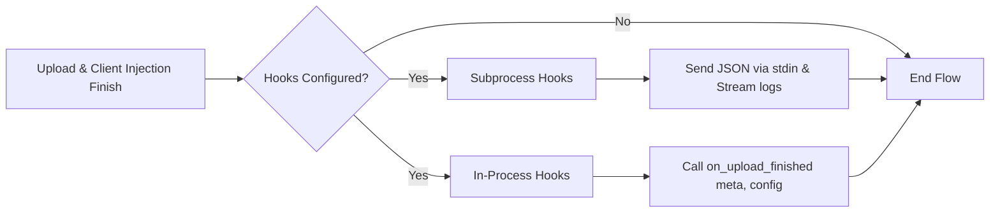

# Custom Post-Upload Hooks

Upload Assistant includes a flexible hook system that allows you to execute custom Python scripts after an item finishes its upload lifecycle (tracker uploads, requests searching, and client injection).

Hooks are completely decoupled from core upload logic: failures, exceptions, or timeouts in hook scripts will **never** fail or interrupt an upload.

---

## Table of Contents

1. [How It Works](#how-it-works)
2. [Hooks Directory Location](#hooks-directory-location)
3. [Configuration Options](#configuration-options)
4. [Hook Types](#hook-types)
   - [Subprocess Hooks (`post_upload_hooks`)](#1-subprocess-hooks-post_upload_hooks)
   - [In-Process Hooks (`post_upload_inprocess_hooks`)](#2-in-process-hooks-post_upload_inprocess_hooks)

---

## How It Works

Whenever an item completes its upload process, Upload Assistant checks the configuration for registered hooks in `custom_hooks/`.

- **Isolated execution:** Hooks run safely after all trackers and clients have been processed.
- **Real-time output:** Standard output (`stdout`) and standard error (`stderr`) from your scripts are captured and relayed directly to the Upload Assistant console logs prefixed with `[hook: <script_name>]`.
- **Timeout protection:** Subprocess hooks that hang or take too long are automatically terminated after a configurable timeout (default: 30s).



---

## Hooks Directory Location

All hook scripts must be located inside the `custom_hooks/` directory in your `STATE_DIR`:

| Environment                    | Directory Path                                                          |
| :----------------------------- | :---------------------------------------------------------------------- |
| **Docker**                     | `/state/custom_hooks/`                                                  |
| **Linux / macOS (Bare metal)** | `~/.local/state/Upload-Assistant/custom_hooks/` or `data/custom_hooks/` |
| **Windows (Bare metal)**       | `%LOCALAPPDATA%\Upload-Assistant\custom_hooks\` or `data\custom_hooks\` |

---

## Configuration Options

Configure your hooks in your `config.py` file under the `DEFAULT` section:

```python
    # ---------------------------------------------------------
    # POST-UPLOAD HOOKS CONFIGURATION
    # ---------------------------------------------------------
    # List of script filenames located in STATE_DIR/custom_hooks/
    # executed as subprocesses receiving JSON over stdin.
    "post_upload_hooks": [
        "discord_notify.py",
        "archive_meta.py",
    ],

    # List of script filenames located in STATE_DIR/custom_hooks/
    # loaded directly into Upload Assistant's python process.
    "post_upload_inprocess_hooks": [
        "internal_logger.py",
    ],

    # Maximum runtime in seconds for each subprocess hook (default: 30).
    # If a script exceeds this duration, it will be terminated.
    "post_upload_hook_timeout": 30,
```

---

## Hook Types

### 1. Subprocess Hooks (`post_upload_hooks`)

- **Best for:** External notifications (Discord, Telegram, Pushover, Webhooks), calling external CLI utilities, backing up files, updating databases.
- **Protocol:** Upload Assistant invokes `python <script_name>.py` and writes the payload as UTF-8 JSON directly to `sys.stdin`.
- **Requirements:** Any valid `.py` file inside `custom_hooks/`.

```python
import json
import sys

# Read payload from standard input
payload = json.load(sys.stdin)
meta = payload.get("meta", {})

print(f"Hook executed for: {meta.get('name')}")
```

### 2. In-Process Hooks (`post_upload_inprocess_hooks`)

- **Best for:** Advanced scripting requiring direct Python object access without JSON serialization overhead.
- **Protocol:** Upload Assistant imports the module and calls `on_upload_finished(meta, config)`.
- **Function signature:** Must define `def on_upload_finished(meta, config):` or `async def on_upload_finished(meta, config):`.
- **Isolation:** Receives an isolated copy `meta.copy()` and a deep copy of `config`.

```python
from src.console import logger


async def on_upload_finished(meta, config):
    logger.info(f"In-process hook completed for {meta.name}")
```

---

## Ready-to-Use Examples

Place these scripts inside `STATE_DIR/custom_hooks/` (e.g. `/state/custom_hooks/` on Docker or `data/custom_hooks/`).

### Example 1: Discord Webhook Notification (Subprocess)

Save as `custom_hooks/discord_notify.py`:

```python
#!/usr/bin/env python3
"""Send upload summary notification to a Discord channel via Webhook."""

import json
import sys
import urllib.request

DISCORD_WEBHOOK_URL = "https://discord.com/api/webhooks/YOUR/WEBHOOK/URL"


def send_discord_notification(payload: dict) -> None:
    meta = payload.get("meta", {})
    release_name = meta.get("name", "Unknown Release")
    category = meta.get("category", "N/A")
    resolution = meta.get("resolution", "N/A")
    media_type = meta.get("type", "N/A")
    tracker_status = meta.get("tracker_status", {})

    # Build list of successful trackers
    successful_trackers = [tracker for tracker, status in tracker_status.items() if isinstance(status, dict) and status.get("upload_success")]
    failed_trackers = [tracker for tracker, status in tracker_status.items() if isinstance(status, dict) and not status.get("upload_success")]

    embed = {
        "title": "🚀 Upload Finished",
        "description": f"**Release:** `{release_name}`",
        "color": 0x2ECC71 if successful_trackers else 0xE74C3C,
        "fields": [
            {"name": "Category", "value": str(category), "inline": True},
            {"name": "Type", "value": f"{resolution} {media_type}".strip(), "inline": True},
            {
                "name": "Trackers (Success)",
                "value": ", ".join(successful_trackers) if successful_trackers else "None",
                "inline": False,
            },
        ],
        "footer": {"text": "Upload Assistant Hook"},
    }

    if failed_trackers:
        embed["fields"].append(
            {
                "name": "Trackers (Failed / Skipped)",
                "value": ", ".join(failed_trackers),
                "inline": False,
            }
        )

    data = json.dumps({"embeds": [embed]}).encode("utf-8")
    req = urllib.request.Request(
        DISCORD_WEBHOOK_URL,
        data=data,
        headers={"Content-Type": "application/json", "User-Agent": "Upload-Assistant-Hook/1.0"},
    )

    try:
        with urllib.request.urlopen(req, timeout=10) as response:
            print(f"Discord notification sent (HTTP {response.status})")
    except Exception as exc:
        print(f"Failed to send Discord webhook: {exc}", file=sys.stderr)


if __name__ == "__main__":
    if DISCORD_WEBHOOK_URL.startswith("https://discord.com/api/webhooks/YOUR"):
        print("Discord Webhook URL not configured. Skipping.", file=sys.stderr)
        sys.exit(0)

    try:
        raw_payload = json.load(sys.stdin)
        send_discord_notification(raw_payload)
    except Exception as err:
        print(f"Error parsing hook input: {err}", file=sys.stderr)
        sys.exit(1)
```

---

### Example 2: Telegram Bot Notification (Subprocess)

Save as `custom_hooks/telegram_notify.py`:

```python
#!/usr/bin/env python3
"""Send upload completion notification via Telegram Bot."""

import json
import sys
import urllib.parse
import urllib.request

TELEGRAM_BOT_TOKEN = "YOUR_BOT_TOKEN"
TELEGRAM_CHAT_ID = "YOUR_CHAT_ID"


def send_telegram_message(text: str) -> None:
    url = f"https://api.telegram.org/bot{TELEGRAM_BOT_TOKEN}/sendMessage"
    payload = {
        "chat_id": TELEGRAM_CHAT_ID,
        "text": text,
        "parse_mode": "HTML",
        "disable_web_page_preview": True,
    }
    data = urllib.parse.urlencode(payload).encode("utf-8")
    req = urllib.request.Request(url, data=data, headers={"User-Agent": "Upload-Assistant-Hook/1.0"})

    with urllib.request.urlopen(req, timeout=10) as response:
        print(f"Telegram notification sent (HTTP {response.status})")


if __name__ == "__main__":
    if "YOUR_BOT_TOKEN" in TELEGRAM_BOT_TOKEN:
        print("Telegram credentials not configured. Skipping.", file=sys.stderr)
        sys.exit(0)

    try:
        payload = json.load(sys.stdin)
        meta = payload.get("meta", {})
        name = meta.get("name", "Unknown")
        trackers = list(meta.get("tracker_status", {}).keys())

        msg = f"✅ <b>Upload Assistant Finished</b>\n\n📦 <b>Release:</b> <code>{name}</code>\n🎯 <b>Trackers:</b> {', '.join(trackers) if trackers else 'None'}"
        send_telegram_message(msg)
    except Exception as err:
        print(f"Failed to execute Telegram hook: {err}", file=sys.stderr)
        sys.exit(1)
```

---

### Example 3: Export & Archive Metadata as JSON (Subprocess)

Save as `custom_hooks/archive_meta.py`:

```python
#!/usr/bin/env python3
"""Save a JSON backup of final upload metadata into an archive folder."""

import json
from pathlib import Path
import sys

ARCHIVE_DIR = Path.home() / "upload_assistant_archive"


def main() -> None:
    ARCHIVE_DIR.mkdir(parents=True, exist_ok=True)
    payload = json.load(sys.stdin)
    meta = payload.get("meta", {})

    release_name = meta.get("name") or meta.get("uuid") or "unnamed_release"
    # Sanitize filename
    safe_name = "".join(c for c in release_name if c.isalnum() or c in "._- ").strip()
    out_file = ARCHIVE_DIR / f"{safe_name}.json"

    with open(out_file, "w", encoding="utf-8") as f:
        json.dump(payload, f, indent=2, ensure_ascii=False)

    print(f"Archived metadata saved to: {out_file}")


if __name__ == "__main__":
    main()
```

---

### Example 4: CSV Upload Logger (Subprocess)

Save as `custom_hooks/csv_logger.py`:

```python
#!/usr/bin/env python3
"""Append uploaded release summary into a local CSV file."""

import csv
from datetime import datetime, timezone
import json
from pathlib import Path
import sys

CSV_LOG_PATH = Path.home() / "uploads_history.csv"


def main() -> None:
    payload = json.load(sys.stdin)
    meta = payload.get("meta", {})

    file_exists = CSV_LOG_PATH.is_file()

    with open(CSV_LOG_PATH, "a", newline="", encoding="utf-8") as csvfile:
        writer = csv.writer(csvfile)
        if not file_exists:
            writer.writerow(["Timestamp_UTC", "Release_Name", "Category", "Resolution", "Type", "Trackers"])

        trackers = list(meta.get("tracker_status", {}).keys())
        writer.writerow(
            [
                datetime.now(timezone.utc).isoformat(),
                meta.get("name", ""),
                meta.get("category", ""),
                meta.get("resolution", ""),
                meta.get("type", ""),
                "; ".join(trackers),
            ]
        )

    print(f"Appended upload record to {CSV_LOG_PATH}")


if __name__ == "__main__":
    main()
```

---

### Example 5: Async In-Process Hook with Project Logger

Save as `custom_hooks/internal_stats.py`:

```python
"""In-process hook example using Upload Assistant's internal logging."""

from typing import Any
from src.console import logger
from src.meta import Meta


async def on_upload_finished(meta: Meta, config: dict[str, Any]) -> None:
    """Async entrypoint called directly in Upload Assistant process."""
    logger.info(f"==> Custom in-process hook processing: {meta.name}")

    total_trackers = len(meta.tracker_status)
    successful = sum(1 for status in meta.tracker_status.values() if isinstance(status, dict) and status.get("success"))

    logger.info(f"==> Upload stats: {successful}/{total_trackers} tracker(s) succeeded.")
```

---
