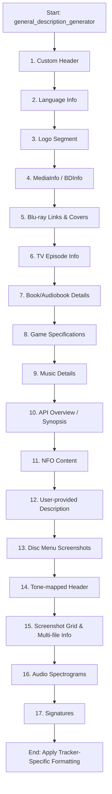

# `DescriptionBuilder` Class Documentation

The `DescriptionBuilder` class (located in [`src/get_desc.py`]) is the central component responsible for formatting and structuring the descriptions sent to trackers. It compiles technical details (such as MediaInfo and BDInfo), metadata from external APIs (TMDb, IMDb, TVMaze, Steam), and visual media (logos, screenshots, audio spectrograms, covers) into clean, organized blocks of BBCode or HTML tailored to each tracker's specific requirements.

This documentation explains in detail the available configuration parameters, the exact execution order of description blocks, tracker-specific behaviors, and provides realistic output examples.

---

## 1. Configuration Settings and Overrides

All variables can be configured globally under the `DEFAULT` section of your configuration file or overridden for individual trackers under the `TRACKERS` section. The class resolves values hierarchically using helper methods (`_get_bool_config`, `_get_int_config`, `_get_str_config`).

Below is the detailed list of configuration variables that affect description building:

### Identity & Logo Settings

- `add_logo` (Boolean): If set to `True`, prepends the media's logo to the description.
  - For `BJSHARE`, `ANTHELION`, `GREATPOSTERWALL`, `BRASILTRACKER`, `FUNFILE`, `HDSPACE`, `HDTORRENTS`, and `SPEEDAPP` trackers, the builder fetches the official TMDB logo resized to a width of 300px.
  - For other trackers, it uses the logo URL parsed during scraping (`meta.get("logo")`).
- `logo_size` (Integer/String): Target width (in pixels) for custom logo rendering. Defaults to `300`.

### Screenshots & Media Layout

- `thumbnail_size` (Integer/String): Default width (in pixels) of screenshot thumbnails in the grid. Defaults to `350`.
- `screens_per_row` (Integer): Number of screenshots to lay out horizontally in each row of the grid. Defaults to `2`.
  - _Note:_ For the `HAWKEUNO` tracker, the code dynamically reduces this value if the total width exceeds 1100px to maintain layout responsiveness.
- `multiScreens` (Integer): Number of screenshots generated per file/disc for pack uploads (multiple discs or files). Setting this to `0` disables screenshot generation for subsequent files in a pack. Defaults to `2`.
- `pack_thumb_size` (Integer): Thumbnail width (in pixels) for pack screenshots. Defaults to `300`.
- `processLimit` (Integer): The maximum number of files/discs in a pack that will be processed individually (meaning they will have screenshots generated and MediaInfo extracted). Prevents excessive resource consumption. Defaults to `10`.
- `fileLimit` (Integer): For multi-file torrents, specifies how many files will be listed directly in the description before nesting the remaining files under a collapsible `[spoiler=Other files]` block. Defaults to `5`.
- `charLimit` (Integer): Maximum string length allowed for the generated description. Used to prevent upload errors due to API character limitations. Defaults to `14000`.

### Custom BBCode Headers & Signatures

- `custom_description_header` (String): A custom BBCode block to prepend to the absolute top of any generated description.
- `screenshot_header` (String): Custom BBCode prepended above the screenshot section (e.g., `[center][b]Screenshots:[/b][/center]`).
- `disc_menu_header` (String): Custom BBCode header for disc menu screenshots.
- `audio_spectrogram_header` (String): Custom BBCode header for audio spectrograms (defaults to `[center][b]Audio Spectrogram[/b][/center]`).
- `custom_signature` (String): Custom signature appended at the absolute bottom of the description.
- `tonemapped_header` (String): A custom header inserted if the video is tone-mapped (`meta.get("tonemapped") == True`).

### Blu-ray & Physical Media Features

- `add_bluray_link` (Boolean): Adds a search/information URL link for physical Blu-ray releases when the media category is `BDMV` or `DVD`.
- `use_bluray_images` (Boolean): Includes Blu-ray/DVD retail cover images from the temporary `covers.json` file.
- `bluray_image_size` (Integer): Width (in pixels) of the cover images. Defaults to `250`.

### Technical Elements

- `episode_overview` (Boolean): If `True` and category is `TV`, retrieves the specific episode's name and overview text from API databases.
- `add_audio_spectrogram` (Boolean): If `True`, attaches audio spectrogram analysis images to the description.
- `audio_spectrogram_duration` (Integer): Seconds to analyse from each selected stream (default: `600`).
- `audio_spectrogram_sample_rate` (Integer): Decode rate for analysis (default: `48000`, preserving frequencies up to 24 kHz).
- `audio_spectrogram_max_files` (Integer): Maximum music tracks or audiobook chapters to process (default: `12`).
- `add_dynamic_hdr_plot` (Boolean): If `True`, attaches Dolby Vision and HDR10+ metadata plot images to the description when applicable.
- `dynamic_hdr_plot_header` (String): Custom BBCode header for dynamic HDR plots.

---

## 2. Description Generation Workflow

When `general_description_generator()` is called, the description is assembled by concatenating blocks of text in a specific order. The flow is visualized below:



### Detailed Block Descriptions

#### 1. Custom Header

Appends the contents of the `custom_description_header` config option, if set. Useful for re-encoder group logos, warning notes, or general announcements.

#### 2. Language Info

Processes audio and subtitle streams. It formats these tracks inside `[code]` blocks if flags like `write_audio_languages`, `write_subtitle_languages`, or `write_hc_languages` are enabled:

```bbcode
[code]Audio Language/s: Japanese, English[/code]
[code]Subtitle Language/s: English[/code]
```

#### 3. Logo Segment

If `add_logo` is enabled, the logo URL is placed inside a central tag:

```bbcode
[center][img=300]https://image.tmdb.org/t/p/w300/example_logo.png[/img][/center]
```

#### 4. MediaInfo / BDInfo

Extracts and includes technical files:

- Reads either a short template-based `MEDIAINFO_SHORT.txt` or a full dump `MEDIAINFO_CLEANPATH.txt`.
- Includes `bdinfo` summary details for BDMV inputs.
- Depending on the tracker, these sections are wrapped in `[pre]`, `[font]`, or `[hide]` blocks.

#### 5. Blu-ray Links & Covers

If uploading a physical disc copy (`BDMV` or `DVD`) and `add_bluray_link` is active, it appends the database URL (`meta.get("release_url")`). If `use_bluray_images` is active, it formats cover images into a responsive grid with links.

#### 6. TV Episode Info

For `TV` category items, if `episode_overview` is enabled, it structures and formats TVMaze or TMDb season and episode synopsis texts, translating HTML formatting to BBCode.

#### 7. Book/Audiobook Details

Processes uploads in the `BOOK` category. It compiles fields such as Author, Translator, Narrator, Publisher, ISBN, ASIN, Edition, and Year into a clean list or `[table]`, including audiobook duration and bitrates if applicable.

#### 8. Game Specifications

For the `GAME` category, it renders:

1.  **Technical Specs:** Platform, Game Version, Genres, Developer, Publisher, Steam link.
2.  **Overview:** The game's description from the Steam API.
3.  **System Requirements:** Minimum and Recommended requirements placed side by side in a `[table]` layout.
4.  **Languages:** A detailed table of supported interface, full audio, and subtitle configurations.

#### 9. Music Details

For `MUSIC` uploads, it renders the normalized release data collected during music preparation: artist, album, original and concrete release years, edition, release type, medium, label, catalogue number, genres, disc/track counts, and detected audio format, codec, bit depth, sample rate, channels, and bitrate.

#### 10. API Overview / Synopsis

Insert the main synopsis (description) retrieved via external APIs (TMDb, IMDb, etc.).

- _Aither Specifics:_ If the upload is a `FraMeSToR` release, formatting is customized to clean and style the scene group's information.

#### 11. NFO Content

Appends scene group release `.nfo` content wrapped in raw formatting blocks (like `[pre]` or `[nfo]`).

#### 12. User-provided Description

Inserts plain text or links supplied manually by the user via file inputs (`description_file_content`) or custom links (`description_link_content`).

#### 13. Disc Menu Screenshots

If the media contains screenshots taken of DVD or BDMV menus (`-menus` / `--disc-menus`), they are placed in a grid using the config's `screens_per_row` settings.

#### 14. Tone-mapped Header

Inserts `tonemapped_header` if the source is tone-mapped from HDR to SDR.

#### 15. Screenshot Grid & Multi-file Info

Handles screenshots for various content layouts:

- **Comparison Uploads:** Employs comparison tags `[comparison=SourceA, SourceB]` with lists of matching URLs.
- **Single File / Disc:** Formats a simple grid of thumbnails matching the specified parameters.
- **Multiple Discs / Files (Packs):** Generates layouts iteratively. Files below `fileLimit` are listed with individual spoiler tags containing their MediaInfo and respective screenshots. Files above `fileLimit` are wrapped together under `[spoiler=Other files]`.

#### 16. Audio Spectrograms

Appends audio spectrogram analyses images in a grid format.

#### 17. Signatures

Appends `custom_signature` and the automated tool signature link:

```bbcode
[center]This is my signature, it will be displayed at the bottom of every description.[/center]
```

---

## 3. Tracker-Specific Layout Formatting

Before returning the compiled string, the builder executes `tracker_specific_formats()` to scrub, replace, or convert BBCode tags that are unsupported by the destination tracker.

| Tracker              | Transformations Performed                                                                                                                                                                                           |
| :------------------- | :------------------------------------------------------------------------------------------------------------------------------------------------------------------------------------------------------------------ |
| **BRASILTRACKER**    | Removes image resizing attributes (`[img=size]`) and `[list]` structures.                                                                                                                                           |
| **BJSHARE**          | Converts `[spoiler]` tags to `[hide]`, removes image resize attributes, removes list tags, and formats alignments.                                                                                                  |
| **ANTHELION**        | Removes image resizing, `[sup]`, `[sub]`, and `[list]` tags. Normalizes special typographic characters (e.g., smart quotes and dashes).                                                                             |
| **DIGITALCORE**      | Removes `[user]`, `[align]`, `[alert]`, `[note]`, `[hr]`, `[ul]`, and `[ol]`. Converts headers (`[h1]`, `[h2]`, `[h3]`) to bold-underline (`[u][b]`), and converts named spoilers to standard ones.                 |
| **FUNFILE**          | Replaces all BBCode images and grids with raw HTML markup (`<a href="..." target="_blank"></a>`), centering elements, and removing spoilers/hide blocks.                                 |
| **GREATPOSTERWALL**  | Strips hyperlink wrappers around screenshots, converting them to plain `[img]URL[/img]` images. Removes sub, sup, and list tags.                                                                                    |
| **HDSPACE**          | Strips colors, hides, and spoilers. If an image is hosted on a host other than Imgbox, it is forced to reside on a separate line (`\n`) to prevent broken forum grids.                                              |
| **HDTORRENTS**       | Converts standard spoilers to `[hide]`, strips image resizing, and limits cover heights to a rigid `137px` via HTML elements.                                                                                       |
| **TORRENTLEECH**     | Converts BBCode centralizing to HTML `<center>`. Converts `[hr]` to `---`. Replaces screenshot blocks with pure HTML links utilizing inline CSS `style="max-width: XXXpx;"` formatting. Removes lists and spoilers. |
| **UNIT3D (Generic)** | Converts all legacy `[hide]` blocks to `[spoiler]` for visual consistency across modern UNIT3D tracker layouts. Converts image comparisons to collapsible details tags (`[collapse]`).                              |

---

## 4. Realistic Output Examples

Here are examples of how raw description payloads generated by `DescriptionBuilder` will look before final submission.

### Example 1: Standard Movie (Movie Category)

```bbcode
[center][img=300]https://image.tmdb.org/t/p/w300/example_logo.png[/img][/center]

[pre]
General
Unique ID                      : 227546593673516597284725301827415174154
Complete name                  : /data/Movies/Example.Movie.2026.1080p.BluRay.x264.mkv
Format                         : Matroska
File size                      : 8.45 GiB
Duration                       : 2 h 5 min
Overall bit rate               : 9 650 kb/s

Video
Format                         : AVC (Advanced Video Codec)
Width                          : 1 920 pixels
Height                         : 1 080 pixels
Display aspect ratio           : 16:9
Frame rate                     : 23.976 (24000/1001) FPS
[/pre]

[center][b]Screenshots:[/b][/center]
[center][url=https://placehold.co/622x350][img=350]https://placehold.co/622x350[/img][/url] [url=https://placehold.co/622x350][img=350]https://placehold.co/622x350[/img][/url]
[url=https://placehold.co/622x350][img=350]https://placehold.co/622x350[/img][/url] [url=https://placehold.co/622x350][img=350]https://placehold.co/622x350[/img][/url][/center]

[right][url=https://github.com/wastaken7/Upload-Assistant][size=4]Upload-Assistant[/size][/url][/right]
```

### Example 2: TV Episode (TV Category)

```bbcode
[center][img=300]https://image.tmdb.org/t/p/w300/series_logo.png[/img][/center]

[center]Season 1 - S01E03: The New Beginning[/center]
[center]Following the chaotic events of the previous episode, the protagonist wakes up in an unfamiliar environment and must discover allies to help find their way back home.[/center]

[pre]
... (Technical MediaInfo of Episode) ...
[/pre]

[center][b]Screenshots:[/b][/center]
[center][url=https://placehold.co/622x350][img=350]https://placehold.co/622x350[/img][/url] [url=https://placehold.co/622x350][img=350]https://placehold.co/622x350[/img][/url][/center]

[right][url=https://github.com/wastaken7/Upload-Assistant][size=4]Upload-Assistant[/size][/url][/right]
```

### Example 3: Game Release (GAME Category)

```bbcode
[size=3][b]Technical Details[/b][/size]
[b]Platform[/b] PC
[b]Version[/b] v1.4.2.Hotfix
[b]Genre[/b] RPG, Action, Co-op
[b]Developer[/b] Indie Game Studios
[b]Publisher[/b] Global Games Inc.
[b]Steam[/b] [url]https://store.steampowered.com/app/1234560[/url]

[size=3][b]Overview[/b][/size]
Explore dangerous dungeons, loot ancient relics, and upgrade your character's abilities in this action-packed RPG with support for local and online co-op play of up to 4 players.

[size=3][b]System Requirements[/b][/size]
[table]
[tr][td][b]Minimum[/b][/td][td][b]Recommended[/b][/td][/tr]
[tr][td]OS: Windows 10 64-bit
Processor: Intel Core i5-4460 or AMD FX-6300
Memory: 8 GB RAM
Graphics: NVIDIA GeForce GTX 760 or AMD Radeon R7 260x
Storage: 15 GB available space[/td][td]OS: Windows 11 64-bit
Processor: Intel Core i7-7700K or AMD Ryzen 5 1600
Memory: 16 GB RAM
Graphics: NVIDIA GeForce GTX 1060 or AMD Radeon RX 580
Storage: 15 GB available space (SSD Recommended)[/td][/tr]
[/table]

[size=3][b]Officially Supported Languages[/b][/size]
[table]
[tr][td][b]Language[/b][/td][td][b]Support[/b][/td][/tr]
[tr][td]English[/td][td]Interface, Audio, Subtitles[/td][/tr]
[tr][td]Portuguese-Brazil[/td][td]Interface, Subtitles[/td][/tr]
[tr][td]Spanish[/td][td]Interface, Subtitles[/td][/tr]
[/table]
```

### Example 4: Book/Audiobook Release (BOOK Category)

```bbcode
[size=3][b]Technical Details[/b][/size]
[table]
[tr][td][b]Author[/b][/td][td]Author Name[/td][/tr]
[tr][td]Publisher[/td][td]Publisher Publishing Group[/td][/tr]
[tr][td]ISBN[/td][td]9788500000000[/td][/tr]
[tr][td]Edition[/td][td]First Special Illustrated Edition[/td][/tr]
[tr][td]Release Year[/td][td]2024[/td][/tr]
[tr][td]Duration[/td][td]10 h 12 min[/td][/tr]
[tr][td]Average Bitrate[/td][td]128 kbps[/td][/tr]
[/table]

[size=3][b]Overview[/b][/size]
A comprehensive and detailed overview of the book's narrative structure, introducing major characters, themes, and key historical contexts.
```
