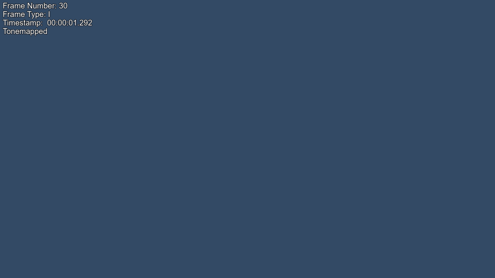
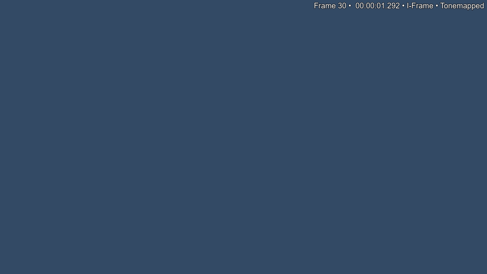

# Screenshot overlays

Screenshot overlays add frame information to captured images. You can configure them directly in your user `config.py`; the WebUI is optional. See the [configuration reference](example-config.md) if you need to locate your config file.

## Choose a layout

Both layouts sit at the **top** of the screenshot. Set `overlay_position` to `"left"` or `"right"` to choose the corner.

These examples use a plain sample background and all four labels, rendered through Upload Assistant's FFmpeg overlay code. The text size is `"30"` to make the labels easier to read here; the default is `"18"`. The Tonemapped label is shown for illustration and only appears on real captures when tone mapping occurred.

### Stacked

Set `"overlay_layout": "stacked"` for one label per line. This is the default layout. Disabled labels leave no empty lines.

```text
Frame Number: 30
Frame Type: I
Timestamp: 00:00:01.292
Tonemapped
```

The example below uses `"overlay_position": "left"`.



### Single line

Set `"overlay_layout": "single_line"` for compact labels separated by bullets. The order is frame number, timestamp, frame type, then Tonemapped. Disabled labels and their separators are omitted.

```text
Frame 30 • 00:00:01.292 • I-Frame • Tonemapped
```

The example below uses `"overlay_position": "right"`. Either layout works on either side.



## Configure the labels

Add or update these entries **inside the existing `DEFAULT` dictionary** in your user `config.py`. This example enables all four labels and matches the single-line screenshot above:

```python
"frame_overlay": True,
"overlay_text_size": "30",
"overlay_position": "right",
"overlay_layout": "single_line",
"overlay_frame_number": True,
"overlay_frame_type": True,
"overlay_timestamp": True,
"overlay_tonemapped": True,
```

To match the stacked example, change `overlay_layout` to `"stacked"` and `overlay_position` to `"left"`.

| Setting                | New-config default | What it controls                                                                                         |
| ---------------------- | ------------------ | -------------------------------------------------------------------------------------------------------- |
| `frame_overlay`        | `False`            | Master switch. Set to `False` to hide all labels while keeping their individual selections.              |
| `overlay_text_size`    | `"18"`             | FFmpeg text size, scaled with screenshot resolution.                                                     |
| `overlay_position`     | `"left"`           | `"left"` for top-left or `"right"` for top-right.                                                        |
| `overlay_layout`       | `"stacked"`        | `"stacked"` for separate lines or `"single_line"` for a compact row.                                     |
| `overlay_frame_number` | `False`            | Frame number; FFmpeg estimates this from the capture time and frame rate.                                |
| `overlay_frame_type`   | `False`            | Picture type, such as I, P or B.                                                                         |
| `overlay_timestamp`    | `False`            | Elapsed video time in `HH:MM:SS.mmm` format.                                                             |
| `overlay_tonemapped`   | `False`            | A label confirming that the screenshot was tone-mapped to SDR. This does not enable tone mapping itself. |

The master switch and at least one applicable label must be enabled for text to appear. On an SDR capture, selecting only `overlay_tonemapped` produces no text. Keep Python booleans as `True` or `False` and quote layout, position and text-size values as shown above.

## Existing configurations

An older config with only `"frame_overlay": True` keeps frame number, frame type and the conditional Tonemapped label enabled. Timestamp stays off. Explicit individual label settings take precedence over these legacy defaults.

When editing manually, set the individual switches explicitly before changing the master so their selections stay the same when you enable it again. The WebUI saves these selections automatically when you change the master.

## Capture behavior

- The images above show FFmpeg output. VapourSynth uses the same label selections, layouts and corner choices, but its built-in font has a different appearance and does not use `overlay_text_size`.
- With FFmpeg capture, active overlays use its existing tone-mapping path instead of libplacebo. Choosing the Tonemapped label does not change the `tone_map` setting.
- Existing upload restrictions still apply: overlays are suppressed for uploads to AvistaZ, CinemaZ and PrivateHD.
- Changes affect newly captured screenshots. Reused images keep any text already present in them. Restart a running CLI process after editing the config, then capture new screenshots to see the result.

In the WebUI, the same settings are under **Screenshot Handling → Screenshot Overlays**. Click **Preview** for an illustrative preview without starting a capture.
